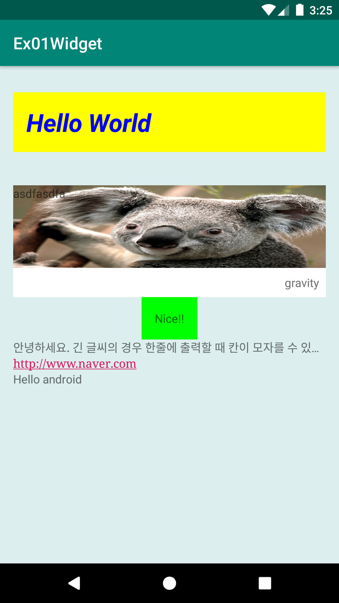
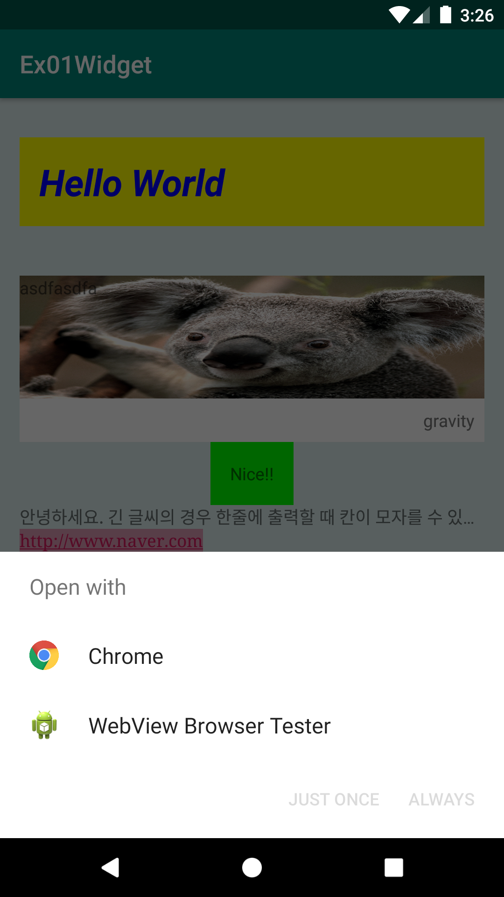
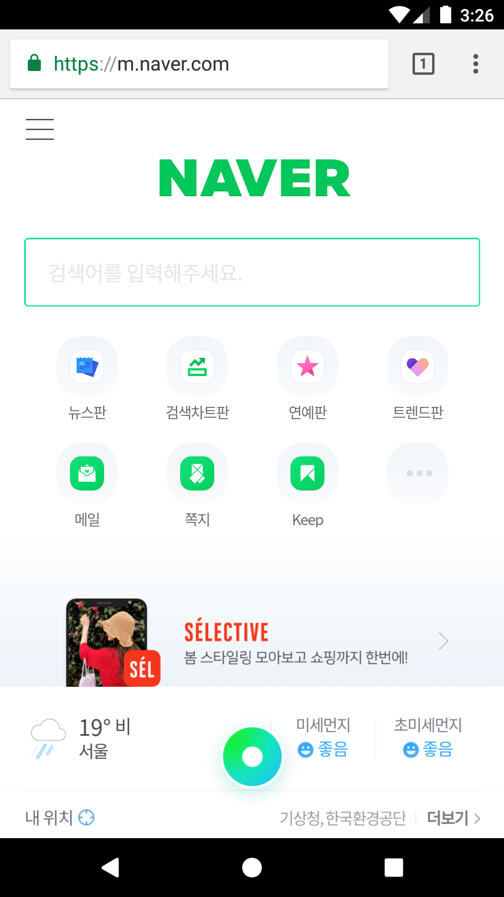

# Ex01Widget
안드로이드 네이티브 앱 개발 수업 예제#1

# 주요코드
액티비티가 보여줄 화면을 구성하는 Widget(View)을 이용하여 UI화면 제작하기 

- res폴더>>layout폴더안에 있는 activity_main.xml문서를 수정하여 화면제작
- 글씨를 보여주는 TextView를 통해 뷰의크기, 색상, 배경, 패딩, 마진, 정렬, autoLink등에 대해 알아보는 예제
- TextView가 여러개이므로 최상위 root뷰로 LinearLayout사용(수직배치:orientation="vertical")

# 실행모습

  
  

  <h4>www.naver.com 링크를 클릭하였을 때 네이버웹페이지가 실행되는 모습</h4>
  
  

 
